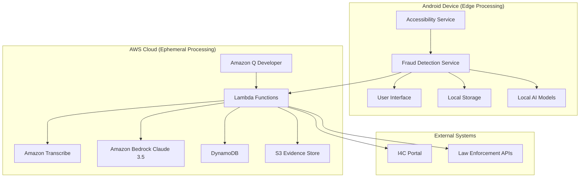
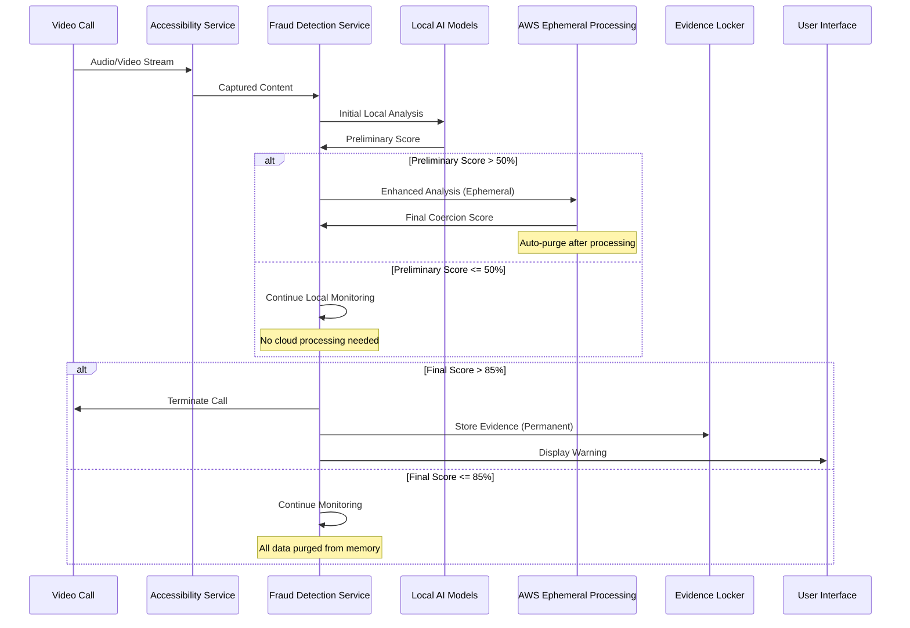
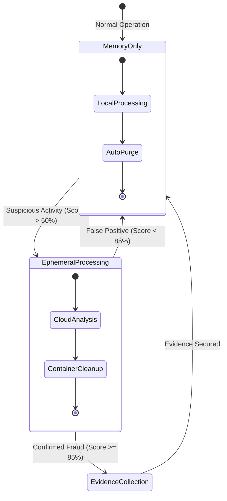

# Design Document: Raksha-Vajra

## Overview

Raksha-Vajra is an autonomous AI-powered Android application designed to protect vulnerable Indian citizens from "Digital Arrest" scams and video-call fraud through real-time multimodal analysis and automatic intervention. The system operates as a background service that continuously monitors active video calls, analyzes audio and visual content for fraud indicators, and automatically terminates suspicious calls while collecting cryptographically secured forensic evidence.

The architecture follows a hybrid edge-cloud approach where critical real-time processing occurs on-device for immediate response, while comprehensive analysis and evidence processing leverage AWS cloud services for scalability and advanced AI capabilities.

## Architecture

### High-Level Architecture



### Privacy-First Edge Architecture

The system implements an "Edge-First" privacy architecture where sensitive audio and video processing occurs primarily on-device or in ephemeral cloud containers that automatically purge data after processing.

**Privacy Processing Flow:**
1. **Local Processing**: Initial fraud detection using cached AI models on-device
2. **Ephemeral Cloud Processing**: Advanced analysis in temporary Lambda containers with automatic memory cleanup
3. **Evidence Collection Trigger**: Only when fraud confidence exceeds threshold does the system transition to evidence retention mode
4. **Zero Retention Guarantee**: All non-scam communications are processed in volatile memory and immediately purged

### System Components

The system is composed of four primary layers:

1. **Edge Processing Layer**: Android application with local AI models for immediate analysis
2. **Ephemeral Cloud Layer**: AWS services with automatic data purging for advanced processing
3. **Evidence Collection Layer**: Secure storage activated only upon confirmed fraud detection
4. **Integration Layer**: Connections to law enforcement and reporting systems

### Data Flow Architecture



### Tech Stack

**Core AI Components:**
- **Amazon Bedrock (Claude 3.5 Sonnet)**: Advanced reasoning for contextual fraud detection and psychological manipulation analysis
- **Amazon Transcribe**: Real-time speech-to-text with Indian language support
- **Amazon Q Developer**: Secure code generation and vulnerability analysis

**Edge Processing:**
- **Android Accessibility Service**: Real-time call monitoring and content capture
- **Local AI Models**: Cached fraud detection models for offline processing
- **Kotlin/Java**: Primary Android development languages

**Cloud Infrastructure:**
- **AWS Lambda**: Serverless ephemeral processing with automatic cleanup
- **Amazon DynamoDB**: Evidence metadata and incident logging
- **Amazon S3**: Encrypted evidence storage with lifecycle policies

**Security & Privacy:**
- **Kyber-512 Post-Quantum Cryptography**: Future-proof evidence encryption
- **TLS 1.3**: Secure data transmission
- **AES-256**: Data encryption at rest

## Privacy Architecture

### Edge-First Privacy Design

The Raksha-Vajra system implements a revolutionary "Edge-First" privacy architecture that ensures user communications remain private unless a confirmed scam is detected. This approach addresses the fundamental privacy concerns of real-time communication monitoring while maintaining effective fraud protection.

### Privacy Processing Layers

#### Layer 1: Local Edge Processing
**Location**: Android Device RAM
**Data Retention**: Zero permanent storage
**Processing Scope**: Initial fraud indicator detection

```kotlin
class EdgePrivacyProcessor {
    fun processInVolatileMemory(audioChunk: ByteArray, visualFrame: Bitmap): PrivacyScore {
        // All processing occurs in RAM only
        val localAnalysis = localAIModel.analyze(audioChunk, visualFrame)
        // Automatic memory cleanup after processing
        return localAnalysis.also { clearProcessingMemory() }
    }
    
    private fun clearProcessingMemory() {
        // Explicit memory cleanup to prevent data persistence
        System.gc()
        overwriteMemoryBuffers()
    }
}
```

#### Layer 2: Ephemeral Cloud Processing
**Location**: AWS Lambda Containers
**Data Retention**: Automatic purge after processing
**Processing Scope**: Advanced AI analysis for suspicious content

```python
class EphemeralCloudProcessor:
    def __init__(self):
        self.auto_cleanup = True
        self.memory_purge_timer = 30  # seconds
    
    def process_with_auto_cleanup(self, encrypted_data: bytes) -> AnalysisResult:
        try:
            # Process in temporary container memory
            result = self.bedrock_analysis(encrypted_data)
            return result
        finally:
            # Guaranteed cleanup regardless of processing outcome
            self.purge_container_memory()
            self.terminate_processing_context()
```

#### Layer 3: Evidence Collection (Triggered Mode)
**Location**: Encrypted S3 Storage
**Data Retention**: Legal retention periods only
**Processing Scope**: Confirmed fraud evidence only

### Privacy State Management



### Privacy Guarantees

#### Zero Data Retention Promise
- **Normal Calls**: 100% of communication data processed in volatile memory only
- **Suspicious Calls**: Enhanced analysis in ephemeral containers with automatic cleanup
- **Confirmed Scams**: Evidence collection with explicit user notification and legal justification

#### Technical Privacy Safeguards
```kotlin
data class PrivacyGuarantee(
    val dataLocation: DataLocation,
    val retentionPeriod: Duration,
    val encryptionStatus: EncryptionStatus,
    val userConsent: ConsentLevel
) {
    companion object {
        val MEMORY_ONLY = PrivacyGuarantee(
            dataLocation = DataLocation.VOLATILE_MEMORY,
            retentionPeriod = Duration.ZERO,
            encryptionStatus = EncryptionStatus.IN_MEMORY_ONLY,
            userConsent = ConsentLevel.IMPLICIT_PROTECTION
        )
        
        val EVIDENCE_MODE = PrivacyGuarantee(
            dataLocation = DataLocation.ENCRYPTED_STORAGE,
            retentionPeriod = Duration.ofDays(2555), // 7 years legal retention
            encryptionStatus = EncryptionStatus.KYBER_512_ENCRYPTED,
            userConsent = ConsentLevel.EXPLICIT_EVIDENCE_COLLECTION
        )
    }
}
```

#### Differential Privacy Implementation
For any system analytics or improvement data, the system implements differential privacy to protect individual user patterns:

```python
class DifferentialPrivacyManager:
    def __init__(self, epsilon: float = 1.0):
        self.epsilon = epsilon  # Privacy budget
        
    def add_noise_to_analytics(self, raw_data: Dict) -> Dict:
        # Add calibrated noise to protect individual privacy
        noise = self.laplace_noise(sensitivity=1.0, epsilon=self.epsilon)
        return {k: v + noise for k, v in raw_data.items()}
```

### Privacy Compliance Framework

#### Indian Personal Data Protection Act Compliance
- **Explicit Consent**: Clear notification when transitioning from memory-only to evidence collection
- **Data Minimization**: Only collect evidence necessary for fraud prevention and legal proceedings
- **Purpose Limitation**: Use collected data solely for fraud prevention and law enforcement cooperation
- **Storage Limitation**: Automatic deletion after legal retention periods expire

#### User Privacy Controls
```kotlin
interface PrivacyControls {
    fun enableMemoryOnlyMode(): Boolean
    fun disableEvidenceCollection(): Boolean
    fun requestDataDeletion(): DeletionResult
    fun getPrivacyReport(): PrivacyReport
    fun optOutOfAnalytics(): Boolean
}
```

## Development & Security Tooling

### Amazon Q Developer Integration

Amazon Q Developer serves as the primary development assistant for ensuring secure, vulnerability-free code generation throughout the Raksha-Vajra development lifecycle.

#### Secure Code Generation
**Purpose**: Generate production-ready, security-hardened code for critical system components
**Applications**:
- **Cryptographic Implementations**: Generating mathematically correct Kyber-512 post-quantum cryptographic code with proper key management
- **Android Security Components**: Creating secure Accessibility Service implementations with proper permission handling
- **AWS Lambda Functions**: Generating serverless functions with built-in security best practices and error handling

**Example Q Developer Usage**:
```
Prompt: "Generate a secure Kotlin implementation of Kyber-512 key encapsulation for Android, 
including proper memory cleanup and side-channel attack resistance"

Q Developer Output: Secure, tested Kotlin code with:
- Constant-time operations to prevent timing attacks
- Secure random number generation
- Proper memory zeroization after use
- Exception handling for cryptographic failures
```

#### Complex Cryptographic Logic Implementation
**Purpose**: Implement sophisticated post-quantum cryptographic algorithms with mathematical correctness
**Key Areas**:
- **Kyber-512 Key Generation**: Secure lattice-based key pair generation
- **Encapsulation/Decapsulation**: Quantum-resistant key exchange mechanisms
- **Digital Signatures**: Post-quantum signature schemes for evidence integrity
- **Hash Chain Management**: Cryptographic proof generation for chain of custody

#### Zero Trust Architecture Reviews
**Purpose**: Conduct comprehensive security architecture analysis to ensure privacy-first design compliance
**Review Areas**:
- **Data Flow Analysis**: Verify that sensitive data never persists beyond intended boundaries
- **Access Control Verification**: Ensure proper authentication and authorization at all system boundaries
- **Encryption Validation**: Confirm end-to-end encryption implementation correctness
- **Privacy Compliance**: Validate adherence to privacy-first architecture principles

**Q Developer Security Review Process**:
```
1. Architecture Analysis:
   - Review system design for potential data leakage points
   - Validate privacy state transitions and data purging mechanisms
   - Assess cryptographic implementation correctness

2. Code Security Scanning:
   - Automated vulnerability detection in generated code
   - Static analysis for common security anti-patterns
   - Dynamic analysis recommendations for runtime security

3. Compliance Verification:
   - Indian Personal Data Protection Act requirement validation
   - International privacy standard compliance checking
   - Legal evidence handling requirement verification
```

#### Vulnerability Analysis and Mitigation
**Continuous Security Assessment**:
- **Real-time Code Scanning**: Automated detection of security vulnerabilities during development
- **Dependency Analysis**: Security assessment of third-party libraries and AWS service integrations
- **Penetration Testing Guidance**: AI-generated test cases for security validation
- **Incident Response Planning**: Automated generation of security incident response procedures

#### Development Workflow Integration
```python
class QDeveloperIntegration:
    def generate_secure_component(self, component_spec: ComponentSpec) -> SecureCode:
        """Generate security-hardened code with Q Developer assistance"""
        return self.q_developer.generate_code(
            specification=component_spec,
            security_requirements=self.get_security_requirements(),
            compliance_standards=["PDPA", "Zero-Trust", "Post-Quantum"]
        )
    
    def review_architecture(self, design_doc: DesignDocument) -> SecurityAssessment:
        """Conduct comprehensive security architecture review"""
        return self.q_developer.analyze_architecture(
            design=design_doc,
            threat_model=self.threat_model,
            privacy_requirements=self.privacy_requirements
        )
```

### Security Development Lifecycle

#### Secure-by-Design Principles
1. **Privacy-First Development**: Every component designed with privacy as the primary constraint
2. **Zero Trust Implementation**: No implicit trust between system components
3. **Post-Quantum Readiness**: All cryptographic implementations quantum-resistant
4. **Automated Security Validation**: Continuous security testing throughout development

#### Quality Assurance Integration
- **Automated Security Testing**: Q Developer-generated security test suites
- **Code Review Automation**: AI-assisted security-focused code reviews
- **Compliance Monitoring**: Continuous validation of privacy and security requirements
- **Vulnerability Management**: Automated tracking and remediation of security issues

## Components and Interfaces

### Android Application Components

#### Accessibility Service (AccessibilityService)
**Purpose**: Monitors active applications and captures audio/visual content from video calls
**Key Responsibilities**:
- Screen content capture during video calls
- Audio stream interception and processing
- Call state monitoring and control
- Permission management for sensitive operations

**Interface**:
```kotlin
interface CallMonitorService {
    fun startMonitoring(): Boolean
    fun captureScreenContent(): Bitmap?
    fun captureAudioStream(): AudioData
    fun terminateActiveCall(): Boolean
    fun isVideoCallActive(): Boolean
}
```

#### Fraud Detection Engine (FraudDetectionEngine)
**Purpose**: Coordinates real-time analysis and intervention decisions
**Key Responsibilities**:
- Orchestrates multimodal analysis pipeline
- Maintains coercion scoring algorithm
- Triggers intervention protocols
- Manages evidence collection workflow

**Interface**:
```kotlin
interface FraudDetectionEngine {
    fun analyzeContent(audio: AudioData, visual: Bitmap): CoercionScore
    fun shouldIntervene(score: CoercionScore): Boolean
    fun executeIntervention(): InterventionResult
    fun collectEvidence(context: CallContext): EvidencePackage
}
```

#### Evidence Locker (EvidenceLocker)
**Purpose**: Secure collection and storage of forensic evidence
**Key Responsibilities**:
- Biometric data capture and hashing
- Post-quantum cryptographic protection
- Chain of custody maintenance
- Legal evidence formatting

**Interface**:
```kotlin
interface EvidenceLocker {
    fun captureEvidence(callData: CallData): EvidencePackage
    fun encryptEvidence(evidence: EvidencePackage): EncryptedEvidence
    fun generateProofOfIntegrity(evidence: EncryptedEvidence): CryptographicProof
    fun submitToLawEnforcement(evidence: EncryptedEvidence): SubmissionResult
}
```

### AWS Cloud Components

#### Real-Time Analysis Lambda (AnalysisOrchestrator)
**Purpose**: Coordinates multimodal AI analysis using AWS services with ephemeral processing
**Key Responsibilities**:
- Audio transcription via Amazon Transcribe with automatic data purging
- Visual analysis via Amazon Bedrock Vision (Claude 3.5 Sonnet) with memory cleanup
- Threat pattern recognition and scoring with zero data retention for non-threats
- Response coordination back to device with automatic container termination

**Interface**:
```python
class AnalysisOrchestrator:
    def analyze_multimodal_content(self, audio_stream: bytes, image_data: bytes) -> CoercionScore
    def process_audio_stream(self, audio: bytes) -> AudioAnalysisResult
    def analyze_visual_content(self, image: bytes) -> VisualAnalysisResult
    def calculate_coercion_score(self, audio_result: AudioAnalysisResult, visual_result: VisualAnalysisResult) -> CoercionScore
    def purge_processing_memory(self) -> None  # Automatic cleanup
```

#### Evidence Processing Lambda (EvidenceProcessor)
**Purpose**: Handles secure evidence processing and legal integration
**Key Responsibilities**:
- Evidence validation and integrity verification
- Legal document formatting
- I4C portal integration
- Long-term secure storage management

**Interface**:
```python
class EvidenceProcessor:
    def validate_evidence_integrity(self, evidence: EncryptedEvidence) -> ValidationResult
    def format_for_legal_submission(self, evidence: EncryptedEvidence) -> LegalDocument
    def submit_to_i4c_portal(self, legal_doc: LegalDocument) -> SubmissionResult
    def archive_evidence(self, evidence: EncryptedEvidence) -> ArchiveResult
```

### Integration Interfaces

#### Amazon Transcribe Integration
**Purpose**: Real-time speech-to-text conversion with Indian language support
**Configuration**:
- Language models: Hindi, English (Indian accent)
- Streaming mode with WebSocket protocol
- Custom vocabulary for law enforcement terminology
- Speaker identification for multi-party calls

#### Amazon Bedrock Integration
**Purpose**: Advanced AI reasoning for fraud detection using Claude 3.5 Sonnet
**Capabilities**:
- Contextual understanding of psychological manipulation tactics
- Intent recognition in multi-turn conversations
- Tonality analysis for authority impersonation detection
- Cross-modal reasoning combining audio and visual fraud indicators
- Real-time threat assessment with confidence scoring

#### Amazon Q Developer Integration
**Purpose**: Secure code generation and vulnerability analysis throughout development
**Usage Areas**:
- **Secure Code Generation**: Generating vulnerability-free Python and Kotlin code for critical security components
- **Cryptographic Implementation**: Implementing complex Kyber-512 post-quantum cryptographic logic with mathematical correctness
- **Zero Trust Architecture Reviews**: Conducting comprehensive security architecture analysis to ensure privacy-first design compliance
- **Vulnerability Scanning**: Automated detection of security weaknesses in generated code
- **Compliance Verification**: Ensuring code meets Indian Personal Data Protection Act requirements

#### I4C Portal Integration
**Purpose**: Automated reporting to Indian Cyber Crime Coordination Centre
**Requirements**:
- Standardized evidence format compliance
- Secure transmission protocols
- Case tracking and follow-up mechanisms
- Legal admissibility standards

## Data Models

### Core Data Structures

#### CallContext
```kotlin
data class CallContext(
    val sessionId: String,
    val startTime: Timestamp,
    val callerNumber: String,
    val callType: CallType,
    val participantCount: Int,
    val deviceInfo: DeviceInfo
)
```

#### CoercionScore
```kotlin
data class CoercionScore(
    val overallScore: Float, // 0-100
    val audioScore: Float,
    val visualScore: Float,
    val behavioralScore: Float,
    val confidence: Float,
    val threatIndicators: List<ThreatIndicator>
)
```

#### EvidencePackage
```kotlin
data class EvidencePackage(
    val evidenceId: String,
    val timestamp: Timestamp,
    val callContext: CallContext,
    val audioEvidence: AudioEvidence,
    val visualEvidence: VisualEvidence,
    val biometricData: BiometricData,
    val cryptographicProof: CryptographicProof
)
```

#### ThreatIndicator
```kotlin
data class ThreatIndicator(
    val type: ThreatType,
    val severity: Severity,
    val description: String,
    val confidence: Float,
    val timestamp: Timestamp,
    val sourceData: String
)
```

### Evidence Data Models

#### AudioEvidence
```kotlin
data class AudioEvidence(
    val audioHash: String,
    val transcript: String,
    val speakerProfiles: List<SpeakerProfile>,
    val threatKeywords: List<String>,
    val emotionalAnalysis: EmotionalProfile,
    val voicePrint: VoicePrint
)
```

#### VisualEvidence
```kotlin
data class VisualEvidence(
    val imageHash: String,
    val detectedObjects: List<DetectedObject>,
    val documentAnalysis: DocumentAnalysis,
    val manipulationIndicators: List<ManipulationIndicator>,
    val uniformAnalysis: UniformAnalysis
)
```

#### BiometricData
```kotlin
data class BiometricData(
    val faceHash: String,
    val voiceHash: String,
    val behavioralFingerprint: String,
    val encryptionKey: String, // Kyber-512 public key
    val integrityProof: String
)
```

### Database Schema (DynamoDB)

#### IncidentTable
- **Partition Key**: incident_id (String)
- **Sort Key**: timestamp (Number)
- **Attributes**: call_context, coercion_score, evidence_package_id, intervention_result, user_id

#### EvidenceTable
- **Partition Key**: evidence_id (String)
- **Sort Key**: evidence_type (String)
- **Attributes**: encrypted_data, integrity_hash, chain_of_custody, legal_status

#### UserTable
- **Partition Key**: user_id (String)
- **Attributes**: device_info, preferences, incident_history, accessibility_settings

## Correctness Properties

*A property is a characteristic or behavior that should hold true across all valid executions of a system—essentially, a formal statement about what the system should do. Properties serve as the bridge between human-readable specifications and machine-verifiable correctness guarantees.*

Based on the prework analysis of acceptance criteria, the following properties ensure system correctness:

### Property 1: Continuous Audio Analysis
*For any* active video call, the fraud detection system should continuously analyze audio streams and identify threat keywords with above 90% accuracy for Indian English and Hindi.
**Validates: Requirements 1.1, 1.2, 5.1, 5.2, 5.3**

### Property 2: Visual Fraud Detection
*For any* visual content during video calls, the system should analyze screen captures for fake uniforms, badges, and official documents, detecting manipulation artifacts and verifying authenticity against known templates.
**Validates: Requirements 1.3, 6.1, 6.2, 6.3, 6.4, 6.5**

### Property 3: Coercion Score Calculation
*For any* combination of fraud indicators (audio, visual, behavioral), the system should calculate weighted coercion scores and increment scores appropriately when aggressive speech patterns or visual fraud are detected.
**Validates: Requirements 1.4, 1.6, 6.6**

### Property 4: Automatic Intervention Protocol
*For any* coercion score exceeding the 85% threshold, the system should immediately terminate the call using network simulation, display warning messages, block the caller for 24 hours, and log the incident with proper timestamps and evidence references.
**Validates: Requirements 2.1, 2.2, 2.3, 2.4, 2.6**

### Property 5: Evidence Collection and Encryption
*For any* detected fraud indicators, the system should capture biometric data, record voice samples, capture screen recordings, encrypt all evidence using Kyber-512 post-quantum cryptography, generate integrity proofs, maintain chain of custody, and format packages for I4C portal compatibility.
**Validates: Requirements 3.1, 3.2, 3.3, 3.4, 3.5, 3.6, 3.7**

### Property 6: Real-Time Performance
*For any* input data, the system should process analysis within 2 seconds, complete interventions within 1 second of threshold breach, handle audio with maximum 500ms latency, and consume less than 200MB of device memory.
**Validates: Requirements 1.5, 2.5, 5.5, 8.5**

### Property 7: Network Resilience
*For any* network conditions including latency up to 2 seconds or intermittent connectivity, the system should maintain protection effectiveness by caching critical models locally and handling up to 10 concurrent analysis sessions.
**Validates: Requirements 8.1, 8.2, 8.4**

### Property 8: Data Security and Privacy
*For any* user data storage or transmission, the system should use AES-256 encryption at rest, TLS 1.3 for communications, obtain explicit consent for biometric processing, maintain audit logs, and securely delete data when retention periods expire.
**Validates: Requirements 7.2, 7.3, 7.5, 7.6, 7.7**

### Property 9: User Interface Accessibility
*For any* user interaction, the system should display status indicators on startup, require no interaction during normal operation, show accessible warnings with high contrast and large fonts, provide voice announcements, support multiple Indian languages, and allow font size adjustment up to 200%.
**Validates: Requirements 4.1, 4.2, 4.3, 4.4, 4.5, 10.1, 10.2, 10.3, 10.4, 10.5, 10.6**

### Property 10: Legal Integration and Reporting
*For any* intervention or evidence collection, the system should automatically generate incident reports, format them according to I4C specifications, submit to law enforcement databases, provide case tracking numbers, and deliver authenticated evidence packages for legal proceedings.
**Validates: Requirements 9.1, 9.2, 9.3, 9.4, 9.5**

### Property 11: Fallback and Recovery
*For any* poor quality audio or system failures, the system should request enhanced processing from backup systems, maintain battery optimization compatibility, and provide simple post-incident guidance without technical jargon.
**Validates: Requirements 5.6, 8.6, 4.6**

<function_calls>
<invoke name="prework">
<parameter name="featureName">raksha-vajra

## Error Handling

### Error Classification

The system implements a comprehensive error handling strategy categorized by severity and impact:

#### Critical Errors (System Shutdown Required)
- **Accessibility Service Failure**: Loss of screen capture or audio monitoring capabilities
- **Evidence Encryption Failure**: Inability to secure forensic data with post-quantum cryptography
- **Memory Exhaustion**: Device memory usage exceeding safety thresholds

#### High Priority Errors (Degraded Protection)
- **AWS Service Unavailability**: Amazon Transcribe or Bedrock Vision service interruptions
- **Network Connectivity Loss**: Extended periods without cloud analysis capabilities
- **Storage Capacity Issues**: Insufficient local storage for evidence collection

#### Medium Priority Errors (Functional Impact)
- **Audio Quality Issues**: Poor transcription accuracy due to noise or compression
- **Visual Analysis Failures**: Inability to process specific image formats or corrupted data
- **Language Detection Errors**: Misidentification of spoken language affecting analysis accuracy

#### Low Priority Errors (User Experience Impact)
- **UI Rendering Issues**: Display problems that don't affect core protection
- **Accessibility Feature Failures**: Screen reader or voice navigation malfunctions
- **Preference Synchronization**: User settings not properly saved or restored

### Error Recovery Strategies

#### Automatic Recovery Mechanisms
```kotlin
interface ErrorRecoveryManager {
    fun handleCriticalError(error: CriticalError): RecoveryAction
    fun attemptServiceRestart(service: SystemService): Boolean
    fun fallbackToLocalProcessing(): Boolean
    fun escalateToUserNotification(error: Error): NotificationResult
}
```

#### Graceful Degradation Patterns
- **Cloud Service Failures**: Automatic fallback to cached local models with reduced accuracy
- **Network Interruptions**: Queue evidence for later transmission while maintaining local protection
- **Resource Constraints**: Dynamic quality adjustment to maintain core functionality

#### User Communication Strategy
- **Critical Errors**: Immediate full-screen alerts with clear action instructions
- **Service Degradation**: Subtle status indicators showing reduced protection levels
- **Recovery Success**: Brief confirmations when full functionality is restored

### Logging and Monitoring

#### Error Logging Framework
```kotlin
data class ErrorLog(
    val errorId: String,
    val timestamp: Timestamp,
    val severity: ErrorSeverity,
    val component: SystemComponent,
    val errorMessage: String,
    val stackTrace: String?,
    val userContext: UserContext,
    val recoveryAction: RecoveryAction?
)
```

#### Monitoring Integration
- **Real-time Error Tracking**: Integration with AWS CloudWatch for immediate alerting
- **Performance Metrics**: Continuous monitoring of response times and resource usage
- **User Impact Assessment**: Tracking of protection effectiveness during error conditions

## Testing Strategy

### Dual Testing Approach

The testing strategy employs both unit testing and property-based testing to ensure comprehensive coverage and system correctness.

#### Unit Testing Focus Areas
- **Specific Examples**: Concrete test cases for known fraud patterns and edge cases
- **Integration Points**: Testing connections between Android components and AWS services
- **Error Conditions**: Verification of proper error handling and recovery mechanisms
- **Accessibility Features**: Testing screen reader compatibility and language support

#### Property-Based Testing Implementation

**Framework Selection**: The system uses **Kotest Property Testing** for Kotlin components and **Hypothesis** for Python AWS Lambda functions.

**Test Configuration**:
- **Minimum 100 iterations** per property test to ensure statistical significance
- **Custom generators** for realistic fraud scenarios, audio patterns, and visual content
- **Shrinking strategies** to identify minimal failing cases for debugging

**Property Test Examples**:

```kotlin
// Property 1: Continuous Audio Analysis
class AudioAnalysisPropertyTest : StringSpec({
    "audio analysis should maintain 90% accuracy across all inputs" {
        checkAll(Arb.audioStream(), Arb.language()) { audioStream, language ->
            val result = fraudDetectionEngine.analyzeAudio(audioStream, language)
            result.accuracy shouldBeGreaterThan 0.9f
            result.threatKeywords.size shouldBe audioStream.countThreatWords()
        }
    }
})

// Property 4: Automatic Intervention Protocol  
class InterventionPropertyTest : StringSpec({
    "intervention should trigger for all scores above threshold" {
        checkAll(Arb.coercionScore(min = 0.85f)) { score ->
            val result = interventionSystem.evaluateScore(score)
            result.shouldIntervene shouldBe true
            result.callTerminated shouldBe true
            result.warningDisplayed shouldBe true
            result.callerBlocked shouldBe true
            result.incidentLogged shouldBe true
        }
    }
})
```

**Property Test Tags**: Each test references its corresponding design property:
- **Feature: raksha-vajra, Property 1**: Continuous Audio Analysis
- **Feature: raksha-vajra, Property 4**: Automatic Intervention Protocol
- **Feature: raksha-vajra, Property 5**: Evidence Collection and Encryption

#### Integration Testing Strategy

**End-to-End Scenarios**:
- **Complete Fraud Detection Flow**: From call monitoring through evidence submission
- **Multi-language Support**: Testing Hindi, English, and regional language processing
- **Accessibility Workflows**: Full testing with screen readers and voice navigation

**Performance Testing**:
- **Load Testing**: Concurrent processing of multiple video calls
- **Stress Testing**: System behavior under resource constraints
- **Network Resilience**: Testing under various connectivity conditions

#### Security Testing

**Cryptographic Verification**:
- **Post-Quantum Encryption**: Validation of Kyber-512 implementation correctness
- **Evidence Integrity**: Testing cryptographic proof generation and verification
- **Chain of Custody**: Verification of tamper-evident evidence handling

**Privacy Compliance Testing**:
- **Data Minimization**: Ensuring only necessary data is collected and stored
- **Consent Management**: Testing opt-in/opt-out mechanisms for biometric processing
- **Secure Deletion**: Verification of complete data removal after retention periods

#### Test Environment Configuration

**Device Testing Matrix**:
- **Android Versions**: Testing on Android 8+ across multiple device manufacturers
- **Hardware Variations**: Different memory, CPU, and network capabilities
- **Accessibility Configurations**: Various screen reader and input method setups

**Cloud Service Testing**:
- **AWS Service Mocking**: Local testing with simulated AWS responses
- **Regional Deployment**: Testing across different AWS regions for latency optimization
- **Service Degradation Simulation**: Testing fallback mechanisms under service failures

### Continuous Integration Pipeline

**Automated Testing Stages**:
1. **Unit Tests**: Fast feedback on component-level functionality
2. **Property Tests**: Comprehensive correctness verification across input spaces
3. **Integration Tests**: End-to-end workflow validation
4. **Security Scans**: Automated vulnerability and compliance checking
5. **Performance Benchmarks**: Regression testing for response times and resource usage

**Quality Gates**:
- **Code Coverage**: Minimum 85% coverage for critical protection components
- **Property Test Success**: 100% pass rate across all property tests
- **Performance Thresholds**: Response times within specified limits
- **Security Compliance**: Zero high-severity security findings

## Development & Security Tooling

### Amazon Q Developer Integration
**Purpose**: Accelerated and secure code generation
**Usage**:
- **Vulnerability Scanning**: Automated detection of OWASP Top 10 security risks in Android/Python code.
- **Secure Implementation**: Generating boilerplates for Kyber-512 implementation and AWS Lambda IAM roles.
- **Architecture Validation**: Verifying "Zero Trust" patterns in the infrastructure-as-code definitions.